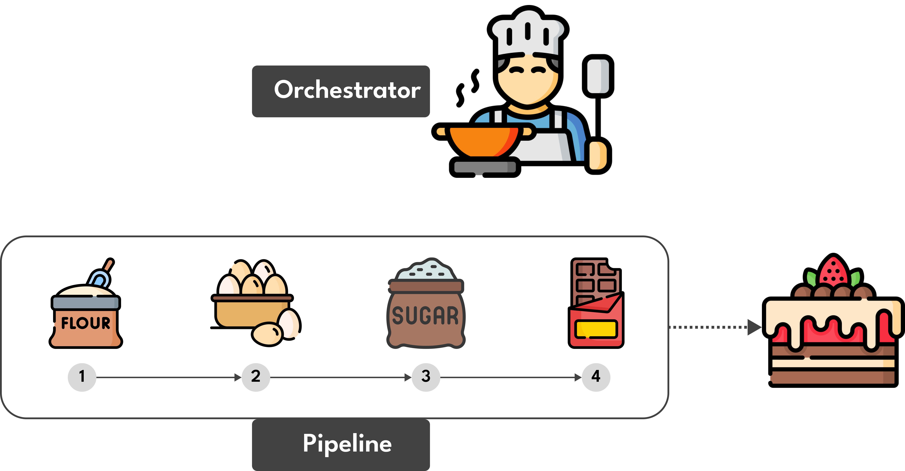

# Data Orchestration

In the meticulous creation of a delectable chocolate cake, adherence to a precise recipe with well-defined steps is paramount. Ingredients such as sugar, flour, eggs, and chocolate are thoughtfully combined under the orchestration of a key actor, analogous to a culinary chef. This orchestrator, akin to the role of the chef, manages the entire process, ensuring each task is executed with precision, culminating in the successful creation of the finished cake. Consequently, the orchestrator's primary objective is to schedule tasks judiciously, leading to a valuable and usable output.

In the domain of data orchestration, the orchestrator assumes the role of overseeing the movement of disparate data to a centralized repository. Subsequently, this data undergoes transformation for activation, exemplified by the generation of reports using business intelligence tools.

# Airflow: An Overview

**Definition**

[Airflow](#https://github.com/apache/airflow) stands as an open-source platform tailored for the development, scheduling, and monitoring of batch-oriented workflows. Rooted in Python, Airflow enables the creation of workflows through Python scripts.

**Inception and Evolution**

- Originating in October 2014, Maxime Beauchemin initiated the Airflow project at Airbnb. 
- From its very inception, the project was open source and officially incorporated into the Airbnb GitHub, as declared in June 2015. 
- By March 2016, Airflow joined the Apache Software Foundation’s Incubator program, attaining the status of a top-level Apache Software Foundation project in January 2019.

# Airflow Concepts

## Directed Acyclic Graph (DAG)

At the heart of Airflow lies the concept of a Directed Acyclic Graph (DAG), serving as the foundational structure that brings tasks together. Organized with dependencies and relationships, the DAG defines the execution order of tasks. When a data pipeline is created, a DAG is instantiated.

The DAG, however, remains agnostic to the internal workings of tasks, focusing solely on the execution logistics—determining the order of execution, specifying retry attempts, managing timeouts, and the like.

## Task

A Task constitutes the fundamental unit of execution within Airflow. Organized within DAGs, tasks establish upstream and downstream dependencies, articulating the sequence in which they should execute.

Tasks come in three primary forms:

- **Operators:** Predefined task templates for quick assembly of most DAG components.
- **Sensors:** A specialized subset of operators focused on awaiting external events.
- **TaskFlow-decorated @task:** Custom Python functions packaged as tasks.

Internally, these task types are subclasses of Airflow’s BaseOperator, with the distinction between Task and Operator serving organizational purposes.

## Operator

An Operator acts as a conceptual template for a predefined Task, declaratively defined within a DAG. Examples include:

- **BashOperator:** Executes a bash command.
- **PythonOperator:** Calls an arbitrary Python function.
- **EmailOperator:** Sends an email.

## Task Instance

A Task Instance represents a specific run of a task, characterized by the combination of a DAG, a task, and a specific execution date. Task Instances belong to DAG Runs and are executable entities derived from written Python code.

## DAG Run

Triggered by Airflow, a DAG Run materializes when a DAG is activated. It encapsulates information such as state, DAG ID, logical date, run ID, run type, and more. The state can be Success, Failed, Running, or Queued.

# Task Lifecycle

A Task’s lifecycle is a progression through various states, reflecting its execution stage within a given DAG and data interval. Possible states include:

- **no_status:** The task, at this point, has not been queued for execution. The scheduler has created an empty task instance, awaiting further instructions.
- **scheduled:** The scheduler, after meticulous evaluation, has ascertained that the task's dependencies are met, signaling its readiness for execution.
- **removed:** A task may enter this state when it mysteriously vanishes from the DAG after the run has commenced.
- **upstream_failed:** In the event of an upstream task failure, coupled with the Trigger Rule's mandate, the task becomes essential, prompting its execution.
- **skipped:** Various conditions, such as branching or the presence of the LatestOnly rule, may lead to the task being skipped in the workflow.
- **queued:** The task has been assigned to an Executor and is currently in a queued state, patiently awaiting assignment to a worker for execution.
- **running:** The task is actively running, either on a dedicated worker or within a local/synchronous executor.
- **success:** Having completed its execution successfully and without encountering errors, the task achieves the state of success.
- **failed:** Regrettably, the task encounters an error during execution, rendering it unsuccessful.
- **restarting:** External requests may necessitate the task to restart while it is already in progress.
- **up_for_retry:** Despite a previous failure, the task is eligible for retries, and if the maximum retry limit is not exceeded, it will be rescheduled.
- **up_for_reschedule:** In the case of a task configured as a Sensor in reschedule mode, it will be rescheduled at defined time intervals.
- **deferred:** The task enters a deferred state, associated with a trigger that may introduce complexities yet to be resolved.

# Basic Architecture

## Core Components

The continuous operation of Apache Airflow relies on core components:

- **Webserver:** A Flask server with Gunicorn serving the Airflow UI.
- **Scheduler:** A multi-threaded Python process responsible for scheduling jobs.
- **Database:** A storage repository for DAG and task metadata.
- **Executor:** The mechanism for running tasks, integral to the operational state of Airflow.

Situational components, such as Worker and Triggerer, are employed selectively for specific tasks or features:

- **Worker**: The process that executes tasks, as defined by the executor. Depending on which executor you choose, you may or may not have workers as part of your Airflow infrastructure.
- **Triggerer**: A separate process which supports deferrable operators. This component is optional and must be run separately. It is needed only if you plan to use deferrable (or "asynchronous") operators.

## Executors

Airflow provides pre-configured executors or allows the creation of custom ones, each serving a distinct purpose:

- **SequentialExecutor:** Executes tasks sequentially without parallelism.
- **LocalExecutor:** Supports parallelism within the scheduler process, suitable for local testing.
- **CeleryExecutor:** Utilizes a Celery backend for coordinating tasks between workers, ideal for environments with consistent task loads.
- **KubernetesExecutor:** Leverages the Kubernetes API to create separate pods for each task, beneficial for long-running tasks with specific resource requirements.

The CeleryKubernetes Executor and Dask Executor are considered more experimental.

For more details, refer to [this link](#https://airflow.apache.org/docs/apache-airflow/stable/core-concepts/executor/index.html) and [this link](#https://medium.com/international-school-of-ai-data-science/executors-in-apache-airflow-148fadee4992) for additional information on Airflow Executors.

# What Airflow is Not

It is crucial to recognize what Airflow is not—neither a streaming solution nor a data processing framework. While proficient in handling batch-oriented workflows and processing data, large data volumes are more efficiently managed by specialized data processing frameworks like Spark, as opposed to Airflow.

# Reference

- https://airflow.apache.org/docs
- https://airflow.apache.org/
- https://docs.astronomer.io/
- https://github.com/apache/airflow
- https://marclamberti.com/