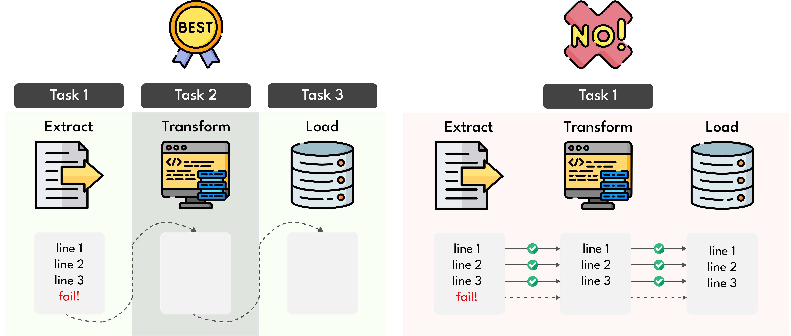
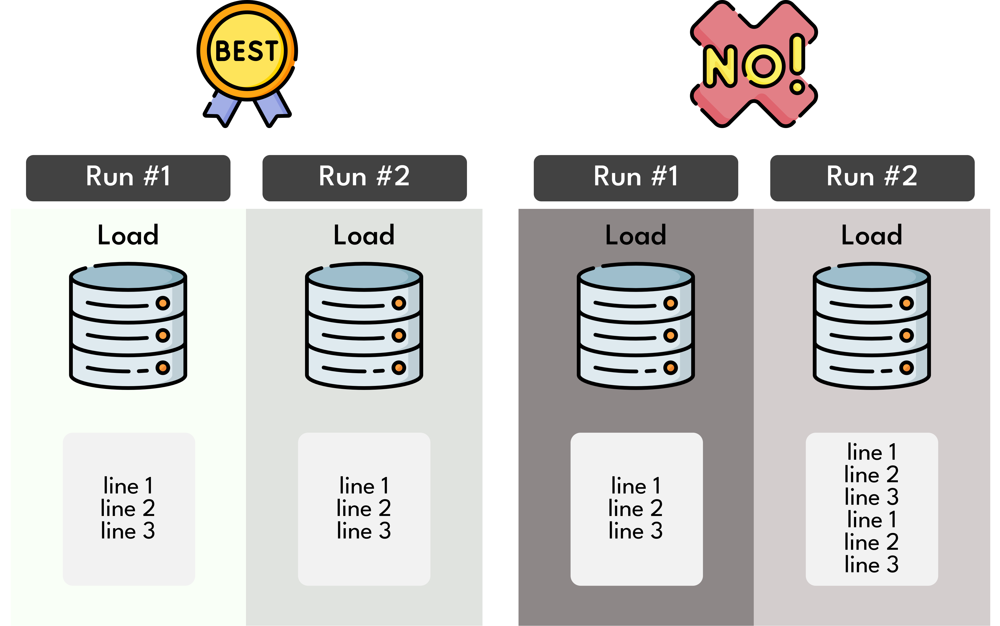

# Best Practices for Designing Tasks

## Atomicity

In the realm of database systems, atomicity refers to transactions that are indivisible, ensuring that all specified operations either fully occur or none occur at all. In Airflow, tasks should emulate this concept, either succeeding and producing a valid result or failing in a way that leaves the system state unaffected.

Benefits of designing atomic Airflow tasks include:
- **Recovery and Rerun:** Tasks enable recovery from failure and facilitate rerunning only the failed and downstream tasks.
- **Maintainability:** Atomic tasks contribute to more maintainable and transparent workflows, minimizing hidden dependencies and side effects.

Consider the scenario where data needs extraction from a CSV file, followed by transformations and writing the results to a database. To ensure robustness, an atomic approach is crucial:
- Extract data from a CSV file.
- Apply transformations.
- Write the results to a database.

Contrast this with a non-atomic approach, where the entire process occurs within a single task. This risky method involves extracting data line-by-line, applying transformations immediately, and uploading results to the database—all in one task.

## Idempotency

Tasks exhibit idempotence when running the same task with identical inputs has no additional effect. This characteristic is vital for maintaining data consistency and simplifying the retrying of failed tasks.

Benefits of idempotent tasks include:
- **Recovery Time:** Decreased recovery time from failure and minimized data loss.
- **Consistent Results:** Tasks that write should adhere to idempotency rules, checking for existing records, overwriting, or using UPSERT operations.

Consider a task fetching data from a database for a specific day and writing the results to a CSV file. An idempotent task overwrites the file for the same day, producing consistent output.

A non-idempotent task appends records to an existing file with each rerun, leading to different results and duplicate records.

# References

- _Data Pipelines with Apache Airflow_, Bas Harenslak and Julian de Ruiter, 2021, Manning Publications.
- [How to Design Better DAGs in Apache Airflow](https://towardsdatascience.com/how-to-design-better-dags-in-apache-airflow-494f5cb0c9ab) @towardsdatascience.com
